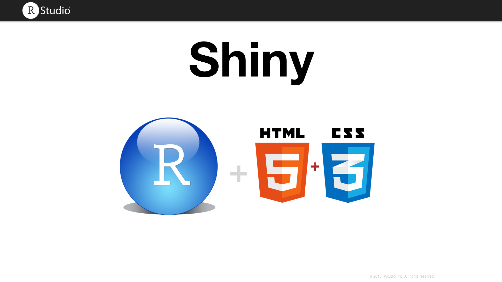
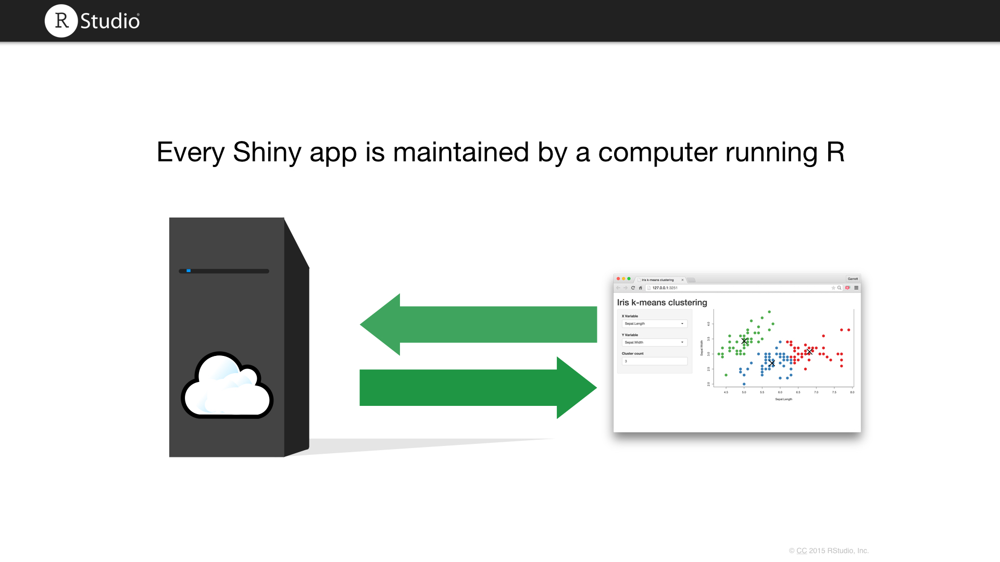
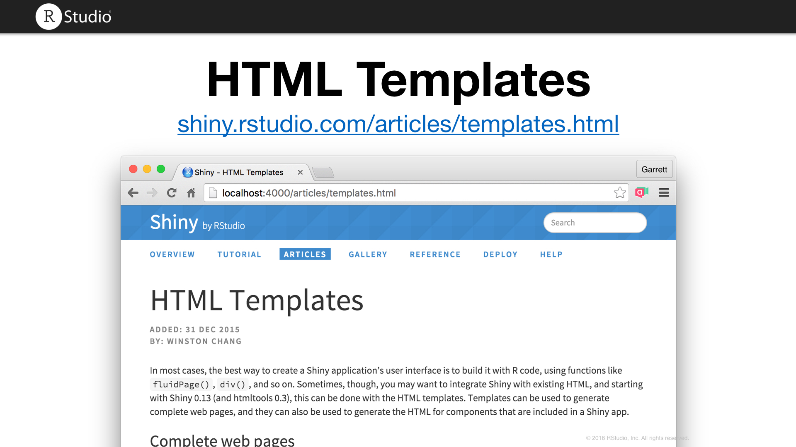
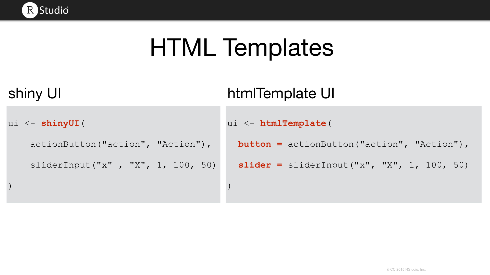
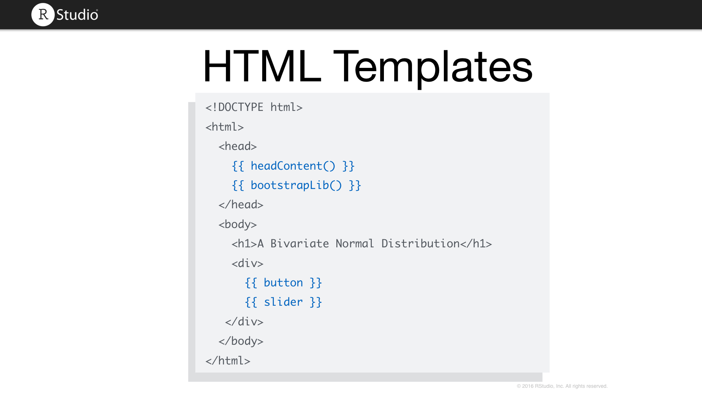
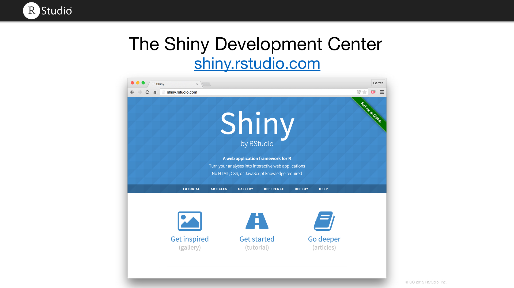
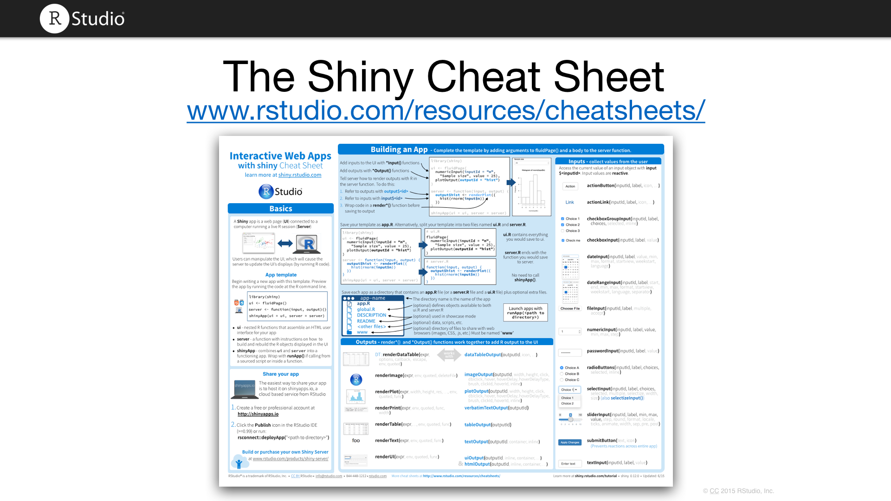
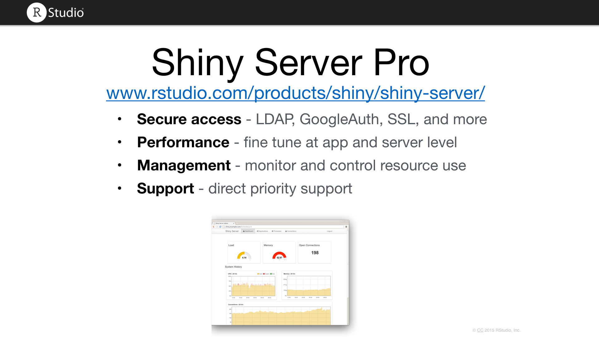
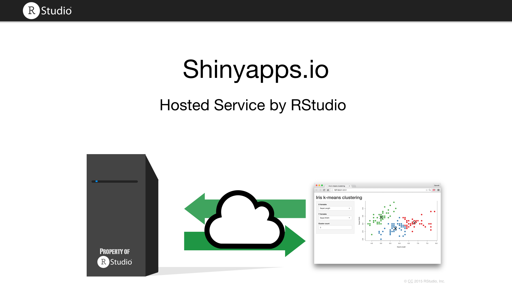

# Shiny Intro

***

***

***

### Basic apps

* [Absorption](http://webpopix.org:8080/dashboard/absorption/)
* [Cluster Profiling](https://gallery.shinyapps.io/LDAelife/)

### App structure - building a simple app

* [Old Faithful](http://shiny.rstudio.com/#)

### Reactive programming

* Apps
    * [Data summary](http://shiny.rstudio.com/gallery/reactivity.html)

* References
    * [Tutorial](http://shiny.rstudio.com/tutorial/)
    * [Articles](http://shiny.rstudio.com/articles/reactivity-overview.html)

* Why use reactive programming?
    * __Concise__. Code is simpler.
    * __Efficient__. Code run faster.
    * __Maintanable__. Code is easier to modify, manage, and share.
* For more information, see [Shiny without reactivity](https://gist.github.com/jcheng5/368ed204f76fa9d130c0).
    
### Advanced apps

* [Police](https://gallery.shinyapps.io/TSupplyDemand/)
* [Database](http://shiny.rstudio.com/gallery/authentication-and-database.html)
* [Crandash](https://gallery.shinyapps.io/087-crandash/)
* [Retirment](http://shiny.rstudio.com/gallery/retirement-simulation.html)

### HTML Templates

Integrate Shiny with existing HTML with HTML templates. Templates can be used to generate complete web pages, and they can also be used to generate the HTML for components that are included in a Shiny app.

* Finance Template
* Education Template
* [College scorecard](https://beta.rstudioconnect.com/jcheng/scorecard-app/)

***

***

***

***

### Interactive graphics

* Moto Trend Cars interactive app
* Moto Trend Cars linked brushing app
* [Interective shiny article](http://shiny.rstudio.com/articles/plot-interaction.html)

### More info

***

***

***

### Deploy

***

***

***

## Shiny dev

* [Modules](http://shiny.rstudio.com/articles/modules.html)
* [Stack Error Traces](http://shiny.rstudio.com/articles/debugging.html)
* [Profiler](http://rpubs.com/wch/123888)
* [Shinydashboard](https://rstudio.github.io/shinydashboard/)